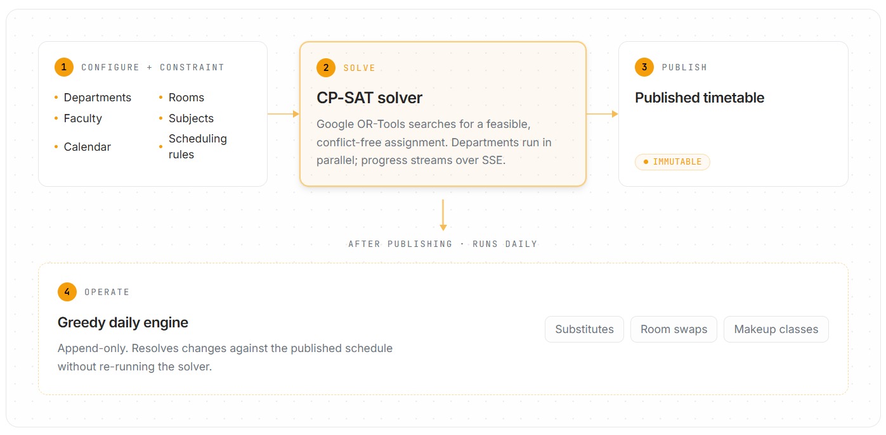
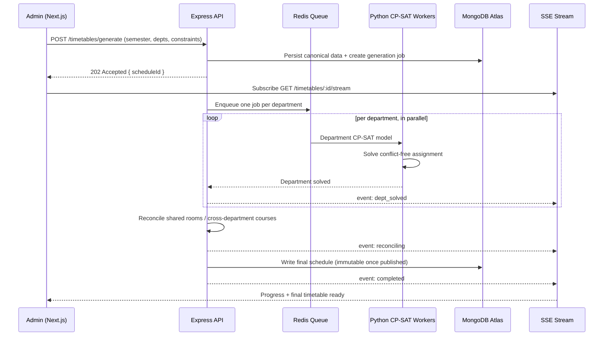
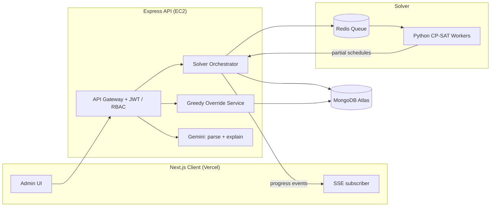

# Headache Solver — University Timetable Optimizer

**A university timetable platform that solves the whole semester exactly with a constraint engine, then handles every daily change with a separate lightweight one — so a single absence never re-runs the solver.**

**Live demo**: [timetable-headache.vercel.app](https://timetable-headache.vercel.app)




Automated university timetable generation. Admins configure departments, faculty, subjects, rooms, and constraints; a constraint-solving engine generates conflict-free timetables in seconds instead of days of manual scheduling.

For a plain-language walkthrough of what the system does and how to demo it, see [HOW_IT_WORKS.md](HOW_IT_WORKS.md). For the system design rationale, see [architecture.md](architecture.md). For a quick project summary, see [About.md](About.md).

---

## 1. What This Solves

University timetabling is a hard constraint problem — every faculty member, room, and batch competes for the same finite grid of day×slot cells, and one bad assignment cascades into conflicts. Teams usually go wrong in one of two ways: they schedule by hand (slow, and double-bookings slip through), or they throw *every* change at one monolithic solver (heavy, slow to re-run, and destabilizing to an already-published term).

Headache Solver splits the problem in two, on purpose:

- **The semester is solved exactly, once.** A Python CP-SAT engine (Google OR-Tools) searches for a feasible, conflict-free assignment. Each department is solved in parallel, then reconciled for shared rooms and cross-department courses.
- **Daily changes never touch the solver.** Absences, room blocks, and makeup classes are resolved by a lightweight greedy pass against the published schedule — the heavy CP-SAT run happens once per term, not once per change.
- **Published timetables are immutable.** Every published schedule is versioned and frozen; daily overrides are append-only, so the source of truth never mutates underneath you.
- **Progress is streamed, not polled.** Generation is a long-running job, so the API pushes `queued → dept_solved → reconciling → completed` events over Server-Sent Events — the UI shows real progress instead of a spinner.

### What that gets you in practice

- **Express orchestrates; Python solves.** Solver logic never leaks into the API layer, so the API and the workers scale independently.
- **One Redis job per department.** Departments solve concurrently, and a single infeasible department doesn't sink the whole run — partial results are persisted and inspectable.
- **A daily absence is a fast greedy substitution**, not a full re-solve of the semester. Daily-operations endpoints stay lightweight and deterministic.
- **Every timetable mutation is auditable.** Schedules are versioned, overrides are append-only, and the audit log records who changed what.
- **The LLM footprint is deliberately small.** Gemini is used for exactly two things — parsing natural-language rules into structured constraints, and explaining *why* an infeasible timetable failed. Nothing in the solve path depends on it.

## 2. Architecture

### How a generation request travels through the system



### System components



### Request lifecycle

1. An admin configures departments, faculty, subjects, rooms, and constraints in Next.js.
2. The frontend submits the payload to the Express API gateway.
3. Express validates input, persists canonical data to MongoDB, and creates a generation job — returning a `scheduleId` immediately.
4. The solver orchestrator normalizes constraints and pushes **one Redis job per department**.
5. Python workers solve department-level CP-SAT models **in parallel**.
6. The orchestrator merges partial schedules, reconciles shared resources, and writes the final timetable back to MongoDB.
7. Progress streams to the UI over SSE (`queued`, `dept_solved`, `reconciling`, `completed`, `failed`).
8. Daily events (absences, room blocks) are handled through a separate **greedy** path and never route through CP-SAT.

## 3. Tech stack

| Layer | Tech |
|---|---|
| Frontend | Next.js + TypeScript + Tailwind + shadcn/ui |
| Auth | JWT + RBAC (admin / HOD / faculty / staff tiers) |
| Backend | Express.js (modular monolith) |
| Database | MongoDB Atlas |
| Queue | Redis (one job per department) |
| Solver | Python + OR-Tools CP-SAT (worker) |
| Streaming | Server-Sent Events (generation progress) |
| AI | Gemini API (constraint parsing, conflict explanation) |

## 4. Project structure

```
frontend/          Next.js app (deployed on Vercel)
backend/            Express API (Docker, deployed on AWS EC2)
workers/python/    CP-SAT solver worker (Docker, deployed on AWS EC2)
docker-compose.yml  Backend + worker + Redis + Caddy stack (used on the EC2 host)
Caddyfile           Reverse proxy / automatic HTTPS config
```

## 5. Data model (key collections)

The full schema lives in [architecture.md § 6](architecture.md#6-data-model--schema-design). The design rules that matter most:

| Collection | Design rule | Why |
|---|---|---|
| `schedules` | Immutable once `status: published`; every publish bumps `version` | The published term is the source of truth — daily changes must never mutate it |
| `daily_overrides` | Append-only, keyed by `date` | Absences / room-blocks / extra-classes are recorded as events, not edits, so history stays auditable |
| `solver_jobs` | One per `{ schedule_id, dept_id }` | Each department is a separate parallel CP-SAT job with its own status and duration |
| `constraints` | Store both `raw_text` and `parsed_json`, typed `hard` / `soft` | Natural-language rules are parsed once (Gemini) and stored structured for the solver |
| `faculty` / `rooms` / `subjects` | Indexed by `dept_id` (+ `type`) | Lookup-heavy solver inputs — indexes keep model assembly fast |

## 6. Local development

Requires Node.js 22+, Python 3.11+, and running instances of MongoDB and Redis (or connection strings to hosted ones).

### Backend

```bash
cd backend
cp .env.example .env   # fill in MONGODB_URI, REDIS_URL, JWT_SECRET, etc.
npm install
npm run dev             # nodemon, http://localhost:8080
```

### Worker

```bash
cd workers/python
python -m venv venv && venv\Scripts\activate   # or `source venv/bin/activate` on macOS/Linux
pip install -r requirements.txt
cp .env.example .env    # same MONGODB_URI and REDIS_URL as the backend
python app/worker.py
```

### Frontend

```bash
cd frontend
npm install
npm run dev              # http://localhost:3000, expects NEXT_PUBLIC_API_BASE_URL (defaults to http://localhost:8080/api/v1)
```

## 7. Deployment

- **Frontend**: Vercel, auto-deployed from `main`.
- **Backend + worker + Redis**: a single AWS EC2 instance running the [docker-compose.yml](docker-compose.yml) stack, fronted by Caddy for automatic HTTPS. See [architecture.md § Deployment](architecture.md#3-deployment) for the full breakdown.
- **Database**: MongoDB Atlas (unchanged regardless of compute provider).

Backend/worker changes are deployed manually: SSH into the EC2 instance and run `git pull && docker compose up -d --build`.

## 8. API docs

See [backend/API_DOCS.md](backend/API_DOCS.md).

## About this project

This is a capstone project built for the completion of a B.Tech CSE degree, by:

- [Adyasha Nanda](https://github.com/Adyasha56)
- [Ankit Kumar](https://github.com/ankitku3101)
