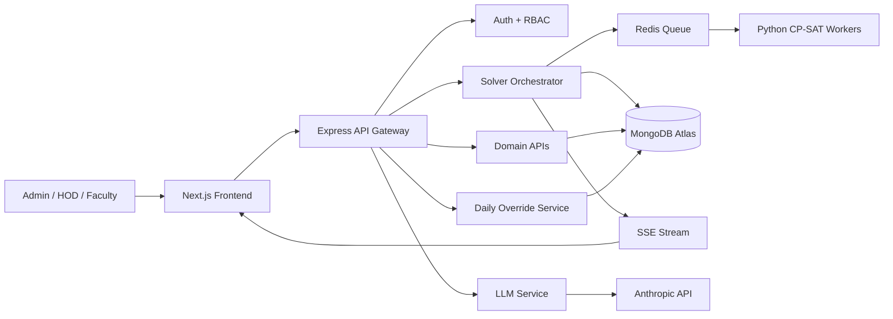

# Timetable Optimizer Architecture

This document turns the ideation notes into a practical implementation plan for a scalable university timetable system.

## 1) Recommended High-Level Architecture

### System flow



### Request lifecycle

1. User configures faculty, subjects, rooms, and constraints in Next.js.
2. Frontend submits payload to the Express API Gateway.
3. Express validates input, persists canonical data to MongoDB, and creates a generation job.
4. The Solver Orchestrator reads the semester data, normalizes constraints, and pushes one Redis job per department.
5. Python workers solve department-level CP-SAT models in parallel.
6. The orchestrator merges partial schedules, runs reconciliation for shared resources, and writes the final timetable back to MongoDB.
7. The API streams progress to the UI through SSE.
8. Daily events such as absences and room blocks are handled through a separate greedy path and never route through CP-SAT.

## 2) Tech Stack Review

### Recommended stack

| Layer | Recommendation | Why |
|---|---|---|
| Frontend | Next.js + TypeScript | Fast UI delivery, SSR when needed, good admin-dashboard fit |
| UI system | Tailwind CSS + shadcn/ui or Radix | Strong composability for dense scheduling screens |
| State/data | React Query + Zustand | Server state and local UI state stay cleanly separated |
| Backend | Express (JavaScript) | Simple, flexible, easy to scale with clear module boundaries |
| Database | MongoDB Atlas | Good fit for evolving scheduling documents and nested structures |
| Queue | Redis | Reliable job coordination for solver workers |
| Solver | Python + OR-Tools CP-SAT | Best-in-class for constraint solving |
| Streaming | SSE | Simpler than WebSockets for generation progress updates |
| Auth | JWT or session tokens + RBAC | Works well for admin/HOD/faculty permission tiers |
| Deployment | Docker Compose on AWS EC2 (backend/worker), Vercel (frontend) | Clear service isolation and repeatable releases |

### Is the stack a good choice?

Yes, with one important refinement: use Express as the backend API layer, but keep solver logic in Python workers and keep the API layer thin and modular. That gives you:

- A clean frontend/backend split.
- A stable API surface for the UI.
- Python where it matters most for CP-SAT.
- Easy horizontal scaling for the API and workers separately.

### What I would change or watch

- I would not force all scheduling logic into Express. Express should orchestrate, validate, authorize, and aggregate, not solve.
- If the backend team wants stronger conventions, NestJS is the alternative, but Express is perfectly acceptable if the codebase is organized well.
- MongoDB is fine for this project because the data model is nested and evolves often, but you should still define strict schemas and indexes.

## 3) Deployment

The frontend, backend, and worker are hosted separately:

| Component | Host | Notes |
|---|---|---|
| Frontend | Vercel | Next.js, auto-deployed from `main` |
| Backend + Worker + Redis | AWS EC2 (single instance) | Docker Compose stack, see below |
| Database | MongoDB Atlas | Unchanged regardless of compute provider |

### Backend/worker stack (EC2)

A single EC2 instance runs a [docker-compose.yml](../docker-compose.yml) stack with four containers:

- **redis** — internal job queue, not exposed outside the Docker network
- **backend** — Express API ([backend/Dockerfile](../backend/Dockerfile)), port 8080 internally
- **worker** — Python CP-SAT solver ([workers/python/Dockerfile](../workers/python/Dockerfile)), consumes the Redis queue
- **caddy** — reverse proxy + automatic HTTPS (Let's Encrypt) for `timetable.ankit31.me`, routes to `backend`

Secrets (`MONGODB_URI`, `JWT_SECRET`, etc.) live in a `.env` file on the instance only — never committed to git.

### Deploying a change

```bash
# on the EC2 instance
cd ~/Timetable_Headache
git pull
docker compose up -d --build   # rebuilds backend/worker images if their code changed
```

`.env` or `Caddyfile` changes don't need a rebuild — `docker compose up -d` (or `docker compose restart caddy`) is enough.

## 3) Backend Architecture

### Backend responsibilities

The Express backend should be split into business modules, not just controllers.

Core modules:

- Auth and RBAC.
- Faculty management.
- Subject management.
- Room management.
- Academic calendar management.
- Constraint capture and normalization.
- Timetable generation orchestration.
- Daily override handling.
- Export services.
- Notification service.
- Audit logging.

### Backend layering

Use a layered structure:

1. Route layer: HTTP endpoints only.
2. Controller layer: request parsing and response formatting.
3. Service layer: business logic.
4. Repository layer: MongoDB access.
5. Worker integration layer: Redis jobs, solver polling, result reconciliation.

This keeps the codebase maintainable as the number of features grows.

### Important design rules

- Base timetable must be immutable after publication.
- Daily overrides are append-only.
- Daily operations must use a greedy algorithm, not CP-SAT.
- Shared rooms and university-wide conflicts should be reconciled at a higher orchestration layer.
- LLM usage should remain limited to the two intentional touchpoints: constraint parsing and conflict explanation.

## 4) API Design

### API conventions

- Base path: `/api/v1`
- JSON request and response bodies
- Standard error envelope for all failures
- Pagination for list endpoints
- Idempotency for generation and override creation where appropriate
- SSE endpoint for long-running solver jobs

### Suggested endpoint groups

#### Auth

- `POST /api/v1/auth/login`
- `POST /api/v1/auth/logout`
- `GET /api/v1/auth/me`

#### Faculty

- `GET /api/v1/faculty`
- `POST /api/v1/faculty`
- `GET /api/v1/faculty/:id`
- `PATCH /api/v1/faculty/:id`
- `DELETE /api/v1/faculty/:id`

#### Subjects

- `GET /api/v1/subjects`
- `POST /api/v1/subjects`
- `PATCH /api/v1/subjects/:id`
- `DELETE /api/v1/subjects/:id`

#### Rooms

- `GET /api/v1/rooms`
- `POST /api/v1/rooms`
- `PATCH /api/v1/rooms/:id`
- `DELETE /api/v1/rooms/:id`

#### Calendars and constraints

- `GET /api/v1/calendars/:semesterId`
- `POST /api/v1/constraints`
- `GET /api/v1/constraints?semesterId=...&deptId=...`
- `POST /api/v1/constraints/parse`

#### Timetable generation

- `POST /api/v1/timetables/generate`
- `GET /api/v1/timetables/:semesterId`
- `GET /api/v1/timetables/:scheduleId/status`
- `GET /api/v1/timetables/:scheduleId/stream`
- `POST /api/v1/timetables/:scheduleId/lock`
- `POST /api/v1/timetables/:scheduleId/publish`

#### Daily operations

- `POST /api/v1/overrides/absence`
- `POST /api/v1/overrides/room-block`
- `POST /api/v1/overrides/extra-class`
- `GET /api/v1/overrides?date=...`

#### Exports

- `GET /api/v1/timetables/:scheduleId/export/pdf`
- `GET /api/v1/timetables/:scheduleId/export/ical`

### Example API flow for generation

1. Frontend calls `POST /api/v1/timetables/generate` with semester, department, and constraint references.
2. Backend returns a `jobId` immediately.
3. Frontend subscribes to `GET /api/v1/timetables/:scheduleId/stream`.
4. Backend emits events like `queued`, `dept_solved`, `reconciling`, `completed`, or `failed`.
5. On completion, frontend fetches the final timetable payload.

### Response format suggestion

```json
{
  "success": true,
  "data": {},
  "meta": {
    "requestId": "req_123",
    "timestamp": "2026-04-12T10:00:00Z"
  },
  "error": null
}
```

### Error format suggestion

```json
{
  "success": false,
  "data": null,
  "error": {
    "code": "SCHEDULE_INFEASIBLE",
    "message": "The current constraints cannot produce a valid timetable.",
    "details": ["faculty_availability_conflict", "room_capacity_conflict"]
  }
}
```

## 5) Scalable Project Design

### Scaling strategy

Start with a modular monolith for the Express backend and separate worker services for solving. That is the best balance of speed and maintainability.

As load grows, split by concern:

- Scale the API independently from workers.
- Scale worker count by department volume.
- Add read replicas or caching for timetable views.
- Move exports, notifications, and analytics into async jobs.

### Performance strategy

- Index all lookup-heavy MongoDB fields: `dept_id`, `semester_id`, `faculty_id`, `room_id`, `status`.
- Cache read-heavy timetable views in Redis.
- Use background jobs for PDF or iCal exports.
- Use SSE for solver progress instead of frequent polling.
- Keep daily override endpoints lightweight and deterministic.

### Solver scaling

- One Redis job per department.
- Separate worker pools by department size if needed.
- Use time limits in CP-SAT to return best-so-far solutions.
- Persist partial results so a failed run can resume or be inspected.
- Add a reconciliation pass for shared rooms and cross-department courses.

### Operational scaling

- Use audit logs for all timetable mutations.
- Version every published schedule.
- Keep published schedules immutable.
- Use feature flags for risky scheduling rules.
- Add monitoring for queue lag, worker runtime, infeasible jobs, and SSE disconnects.

## 6) Data Model / Schema Design

### Core collections

#### users

```js
{
  _id,
  name,
  email,
  password_hash,
  role, // admin | hod | faculty | staff
  dept_id,
  status,
  created_at,
  updated_at
}
```

#### role_assignments

```js
{
  _id,
  person_id,
  role, // HOD, exam_coordinator, etc.
  dept_id,
  academic_year,
  active,
  can_take_classes,
  starts_at,
  ends_at
}
```

#### faculty

```js
{
  _id,
  user_id,
  name,
  type, // faculty | lab_assistant | visiting
  expertise: [subject_code],
  max_hours_per_week,
  availability: [[Boolean]],
  preferences: {
    preferred_slots: [{ day, slot }],
    avoid_slots: [{ day, slot }]
  },
  joined_date,
  status,
  is_probation
}
```

#### departments

```js
{
  _id,
  code,
  name,
  faculty_count,
  room_group,
  active
}
```

#### subjects

```js
{
  _id,
  code,
  name,
  dept_id,
  type, // theory | lab | tutorial
  credits,
  sessions_per_week,
  session_duration_slots,
  batch_count,
  requires_lab_assistant,
  room_type_required,
  enrollment,
  active
}
```

#### rooms

```js
{
  _id,
  name,
  type, // classroom | lab | seminar_hall | auditorium
  capacity,
  dept_id,
  amenities: [String],
  blocked_slots: [{ day, slot }],
  active
}
```

#### academic_calendars

```js
{
  _id,
  year,
  semester,
  start_date,
  end_date,
  holidays: [Date],
  half_days: [Date],
  events: [{ date, slots_blocked: [{ day, slot }], name }]
}
```

#### constraints

```js
{
  _id,
  semester_id,
  dept_id,
  raw_text,
  parsed_json,
  type, // hard | soft
  weight,
  created_by,
  status,
  created_at
}
```

#### solver_jobs

```js
{
  _id,
  schedule_id,
  dept_id,
  status, // pending | running | done | failed
  queue_name,
  result,
  error,
  duration_ms,
  created_at,
  updated_at
}
```

#### schedules

```js
{
  _id,
  semester_id,
  dept_id,
  status, // draft | published | archived
  version,
  sessions: [{
    faculty_id,
    subject_id,
    room_id,
    day,
    slot,
    is_locked,
    batch
  }],
  created_at,
  published_at
}
```

#### daily_overrides

```js
{
  _id,
  date,
  type, // holiday | half_day | teacher_absent | room_blocked | extra_class
  original_teacher_id,
  substitute_teacher_id,
  slot: { day, period },
  subject_id,
  room_id,
  reason,
  created_by,
  notified_at,
  created_at
}
```

### Recommended indexes

- `faculty.dept_id`
- `faculty.expertise`
- `subjects.dept_id`
- `rooms.dept_id`
- `rooms.type`
- `constraints.semester_id + dept_id`
- `solver_jobs.schedule_id + dept_id + status`
- `schedules.semester_id + dept_id + status`
- `daily_overrides.date`

## 7) Frontend Architecture

### Frontend goals

The UI needs to support dense data entry, a long-running generation flow, and live conflict feedback without becoming cluttered.

### Frontend modules

- Authentication screens.
- Dashboard.
- Faculty grid editor.
- Subject allocation editor.
- Room inventory editor.
- Constraint input and review.
- Generation progress page.
- Timetable grid view.
- Conflict panel.
- Daily override management.
- Export actions.

### Frontend state strategy

- Use server state for persisted entities.
- Use local UI state only for transient interactions like drag-and-drop.
- Keep solver progress in a dedicated store or query stream.
- Validate forms on the client and again on the server.

### UX principles

- Prefer a grid-first layout for timetables.
- Keep conflict feedback visible beside the schedule.
- Make generation progress explicit and auditable.
- Provide quick filters by department, faculty, room, and day.
- Support keyboard shortcuts for power users.

## 8) Folder Structure

### Recommended repository layout

```text
root/
├── frontend/
├── backend/
├── workers/
├── docs/
├── infra/
└── docker-compose.yml
```

### Frontend structure

```text
frontend/
├── src/
│   ├── app/
│   │   ├── (auth)/
│   │   ├── (dashboard)/
│   │   ├── timetable/
│   │   ├── faculty/
│   │   ├── subjects/
│   │   ├── rooms/
│   │   ├── constraints/
│   │   └── overrides/
│   ├── components/
│   │   ├── ui/
│   │   ├── tables/
│   │   ├── forms/
│   │   └── charts/
│   ├── features/
│   │   ├── auth/
│   │   ├── timetable/
│   │   ├── solver-progress/
│   │   └── overrides/
│   ├── hooks/
│   ├── lib/
│   ├── store/
│   ├── types/
│   └── utils/
├── public/
├── tests/
└── package.json
```

### Backend structure

```text
backend/
├── src/
│   ├── config/
│   ├── modules/
│   │   ├── auth/
│   │   ├── users/
│   │   ├── faculty/
│   │   ├── subjects/
│   │   ├── rooms/
│   │   ├── calendars/
│   │   ├── constraints/
│   │   ├── timetables/
│   │   ├── overrides/
│   │   ├── jobs/
│   │   ├── exports/
│   │   └── notifications/
│   ├── common/
│   │   ├── middleware/
│   │   ├── errors/
│   │   ├── validators/
│   │   ├── logger/
│   │   └── constants/
│   ├── integrations/
│   │   ├── mongo/
│   │   ├── redis/
│   │   ├── sse/
│   │   └── anthropic/
│   ├── jobs/
│   ├── services/
│   ├── app.ts
│   └── server.ts
├── tests/
└── package.json
```

### Worker structure

```text
workers/
├── python/
│   ├── app/
│   │   ├── solver/
│   │   ├── models/
│   │   ├── constraints/
│   │   ├── reconciliation/
│   │   └── queue/
│   ├── tests/
│   ├── requirements.txt
│   └── Dockerfile
```

## 9) Implementation Order

### Phase 1

- Set up the monorepo structure.
- Create MongoDB schemas and indexes.
- Build Express CRUD modules.
- Add Redis job dispatch.
- Build a single Python CP-SAT worker.
- Render a static timetable grid in Next.js.

### Phase 2

- Add SSE progress streaming.
- Add conflict panel UI.
- Add LLM constraint parsing.
- Add infeasibility explanation flow.

### Phase 3

- Add daily override workflows.
- Add greedy substitute and room-swap logic.
- Add academic calendar blocking.
- Add year rollover support.

### Phase 4

- Add cross-department reconciliation.
- Add export pipelines.
- Add lock/unlock and manual adjustments.
- Add fairness and utilization analytics.

## 10) Final Recommendation

The overall stack is strong for this domain. Next.js + Express + MongoDB + Redis + Python OR-Tools is a sensible split for a large timetable platform because it separates UI, orchestration, persistence, and optimization cleanly.

If you keep the backend modular, isolate solver logic, and enforce the rule that daily operations stay greedy, the project will scale without becoming over-engineered.